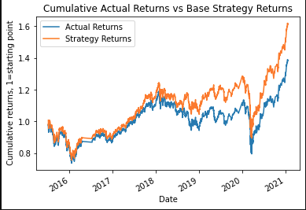
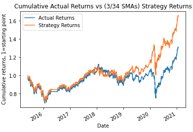
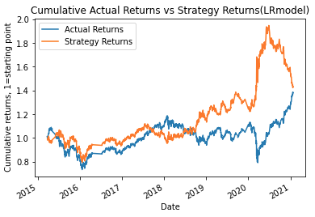

# Algorithmic_Trading
Challenge 14 for Fintech bootcamp through UC Berkeley. Using machine learning to create trading algorithms and back test the model and optimize/tune it for better performance. The goal is to create a model that can take in Simple Moving Average (SMA) data from an asset, and predict whether to buy or sell and make a profit.

Two models were used, tested and optimized to try and get the best results compared to the actual daily returns of the asset. Specifically in the `machine_learning_trading_bot.ipynb` the first model used is the `SVC` classifier model from SKlearn's Support Vector Machine(SVM). The second model trained is a `LogisticRegression` model initially trained on the same parameters as the SVC model, but then I optimized the training data to get a better performance. 

Below you can get setup with a `dev` environment and get the packages needed to run the models. If you skip below that you will find the results of my analysis with the models and optimizing them.

---
## Packages and Version

First before installing any packages and getting setup make sure you are in a `dev` environment or an environment(env) you are comfortable downloading packages into. 
To get your `dev` environment setup do the following in your command line:

- Creating a dev environment for python 3.7 called 'dev' - if you do not already have an environment setup 
    - Get setup in your preferred CLI (Gitbash, terminal, etc)
    - `conda create -n dev python=3.7 anaconda`
    - Once you have created the environment, type the following to activate and deactivate.

Once you are setup with your `dev` or similar env the only package you need is for the machine learning models, alot of packages are included in scikit-learn.

- scikit-learn == 1.0.2 or higher
        -pip install -U scikit-learn
    

Then you are good to open up jupyter lab and run the code. 

---
## Results and Usage

To get the jupyter lab open, navigate to the recently copied github repo with the `machine_learning_trading_bot.ipynb` notebook. Activate your `dev` environment and then type `jupyter lab` and voila! You can navigate the notebook and mess with the parameters to adjust the models or create some new ones at the bottom. 

The strategy that I used to train the model stayed the same. The strategy was simple, when the 'Actual Return' (% daily move) was + then buy or (1), when the Actual Return was - then sell, or (-1). The signal column then takes this simple strategy and shifts it one date, meaning the results from the previous data dictate the next move. If the previous return was negative, sell and if positive, buy. 

The parameters that I adjusted were the length of training data(how long the model trained, 1-10 months), and the length of the SMA's(Short and Long SMA) . Below will be three images, the first is the base SVC model which is the strategy that was preset with 4 days/100 days SMA, and 3 months of training. The second photo will be the optimized SVC model with 3 months of training and 3days/45days SMA. The third photo will be the LogisticRegression(LR) model, with 1 month of training and 3days/45days SMA. 

In the above photos you can clearly see how the first two are very similar with some minor improvement in the strategy returns (orange line) on the second one. Below are some notes I found on optimizing the SVC model with the two parameters I could easily adjust.

- Changing length of training
    - Different lengths of time (from 1 months to 10 months) I was getting an error every time I tried to set the training period to something longer than 11 months. Did not seem to change the quality of the model too much, the `classification report` did tune a little with different lengths, but nothing significant that seemed to show a pattern. The main change was the results of the actual returns, due to a different starting point for the testing period. This would mean that the 'entry' point for the investment happened at a different price resulting in different returns. Model performance varied slightly with different training periods, with no observable trend.

- changing length of SMAs
    - Changing the SMAs make a difference to the dataset, based on how long the SMAs are, this also results in changing the training data for the model, with different values to learn from when making predictions. The results could be noticed with some models performing significantly worse on the cumulative results compared to other models. Similar with the length of the training, there was a difference in performance between the models but changing the SMA windows didn’t seem to produce a consistent trend as to why it would be better or worse. It was more trial and error until I found the best performing model that was slightly better than the preset one. 

The LR model seemed to have the same flaw each time I ran different parameters, where it would start strong and then end by losing alot of value. The image above shows the best performing LR model I could find when messing around with the parameters. 

More research would be required before I would want to put my money down on either of these models and have it trade for me. But it is cool to see that each model did seem to outperform just holding the asset and made more money by running its fully automated trading strategy. This does not consider the cost of doing those trades, or the taxes that come with any gains or losses. Purely just testing out the models and seeing what predictions they come up with and how well they perform against old data

---
## Contributors

[Robin Thorsen] (https://www.linkedin.com/in/robin-thorsen-079819120/) was the main developer/analyst working on this project. Starter code and resources provided by UC Berkeley.

Best reached via email or linkedin - robinbthorsen@gmail.com

---

## License

Apache 2.0 public License applied, feel free to clone and fork and use and reach out if you have questions. 

